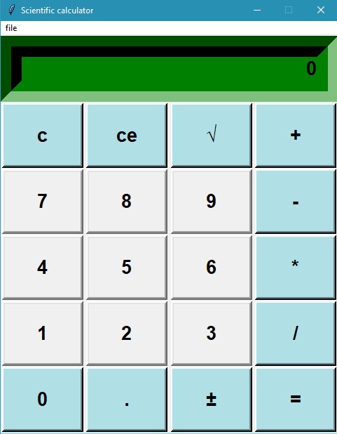
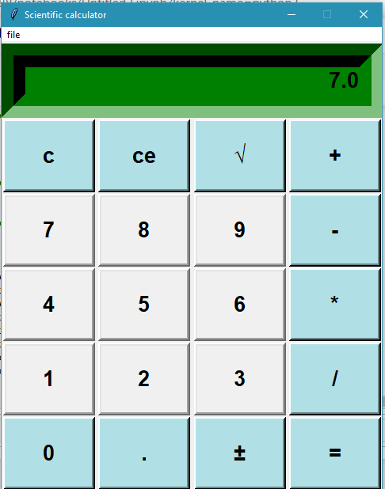
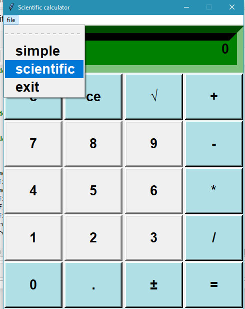
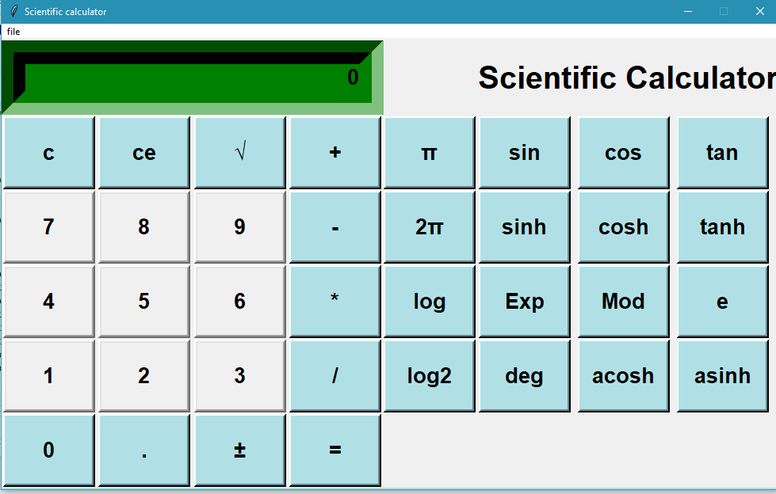
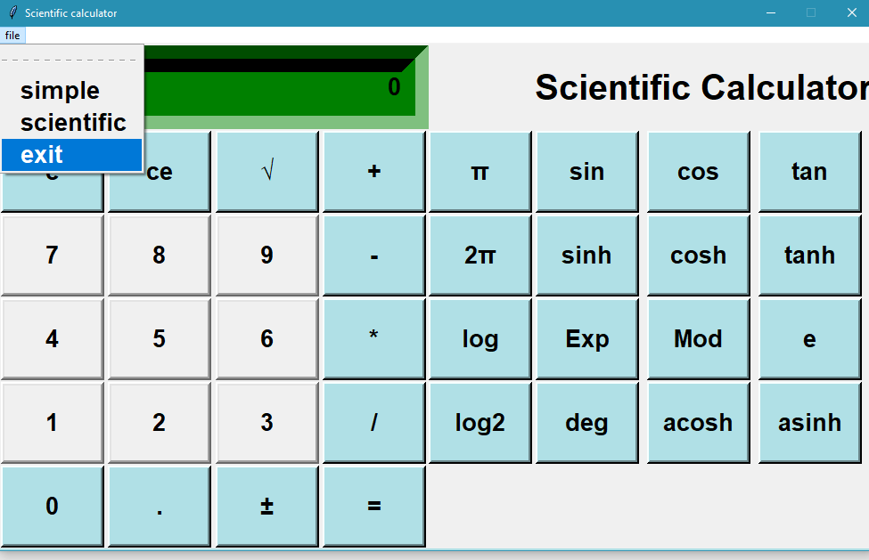
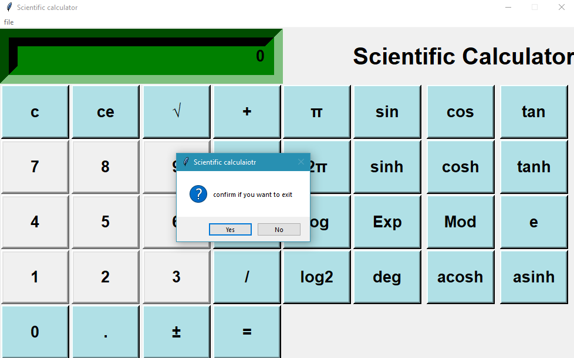

# scientific_calculator
Calculator made using tkinter in Python. Tkinter is the standard GUI library for Python.Tkinter provides various controls, such as buttons, labels and text boxes used in a
GUI application. These controls are commonly called widgets. There are currently 15 types of widgets in Tkinter which includes checkbuttonm labels, listbox,radiobutton , text etc.

## Few Glimpses of this scientific calculator
 
 ### 1. simple calculator
 
 
 
 ### 2. Basic calculation performed 
 
 
 ### 3. Switching to scientific calculator:
 > click on file above < choose scientific calculator as shown below :

### 4. Final look of scientific calculator :

### 5. Exit
> Click on file < Exit as shown below:

### 6. Dialog box for exit:

